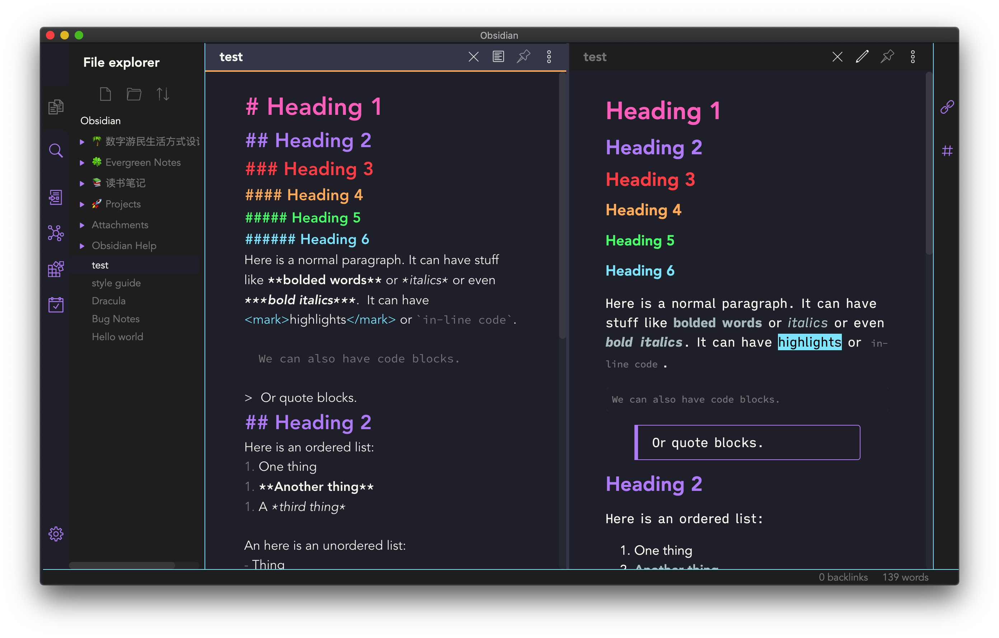
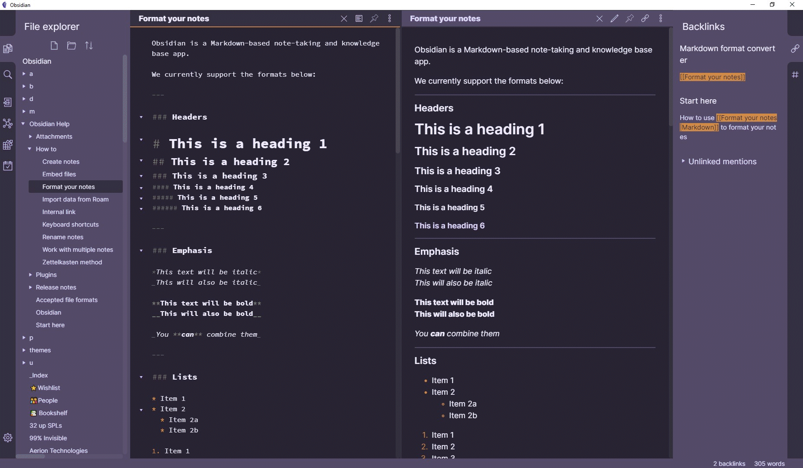

A curated list of awesome themes and plugins for [Obsidian](https://obsidian.md/).

---

# Table of contents

- [Themes](#themes)

# Themes

| Name | Description | Image |
| :--: | :---------- | ----- |
[Dracula for Obsidian](https://github.com/jarodise/Dracula-for-Obsidian.md) | A dark theme for Obsidian, compatible to Obsidian V0.5.0 | 
[80s Neon for Obsidan](https://github.com/deathau/80s-Neon-for-Obsidian.md) | A retro-future 80s inspired theme for Obsidian, compatible with Obsidian V0.5.0  | 
[Base2Tone for Obsidian](https://github.com/deathau/Base2Tone-For-Obsidian.md) | A theme for Obsidian based on http://base2t.one/ with default hues from http://simurai.com/duotone-dark-sky-syntax/ | 