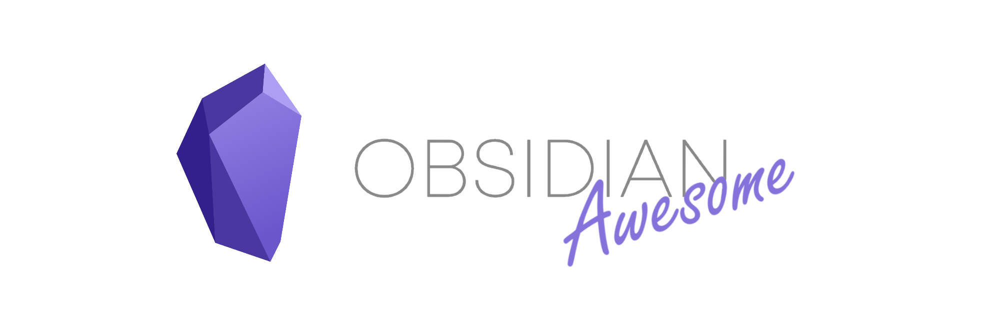

A curated list of awesome themes, plugins and more for [Obsidian](https://obsidian.md/).

---

# Table of contents

- [What is Obsidian?](#what-is-obsidian)
- [Resources](#resources)
- [Plugins](#plugins)
- [External Tools](#external-tools)
- [Templates](#templates)
- [CSS Snippets](#css-snippets)
- [Themes](#themes)
- [For Developers](#for-developers)

# What is Obsidian?

- [Official Obsidian Website](https://obsidian.md)
- [Reviews, Pros and Cons of Obsidian at Slant.co](https://www.slant.co/options/37045/~obsidian-md-review)
- [Obsidian at Markdown Guide](https://www.markdownguide.org/tools/obsidian/)
- [Obsidian Beginner Guide at SitePoint](https://www.sitepoint.com/obsidian-beginner-guide/)
- [Obsidian Official Roadmap](https://trello.com/b/Psqfqp7I/obsidian-roadmap)

# Resources

- [Obsidian Help](https://help.obsidian.md/): a open-source Obsidian's official help vault.
- [Obsidian Roundup](https://obsidianroundup.org/): a weekly roundup of Obsidian.md tips, news & resources via Eleanor Konik.
- [Obsidian Garden](https://obsidian.garden): a open-source guide to creating your own 🌳 Digital Garden with Obsidian.
- [Official Getting Started Guide](https://dynalist.io/d/CQ4V16tFhIJIfy-rgDK7r1Bp) (may be a little outdated)
- [🎬 Obsidian Office Hours](https://www.youtube.com/channel/UCJKoNPnBdCSloJ2wlKnV2Fw)
- [🎬 Obsidian Community Talks](https://www.youtube.com/channel/UCxNSTq2kmupdR6LD400FpvA)
- [🎬 Linking Your Thinking (Nick Milo)](https://www.youtube.com/channel/UC85D7ERwhke7wVqskV_DZUA)
- [🎬 Bryan Jenks](https://www.youtube.com/channel/UCfhSB16X9MXhzSFe_H7XbHg)
- [🎬 Productivity Guru](https://www.youtube.com/playlist?list=PLvmlaxyxtsWz428CtIo_Ia8Bhbo8Uvq2f)
- [🎬 Santi Younger](https://www.youtube.com/playlist?list=PL_7j1BHf-xmj3Jr2h3lI6SXlvIaIjcmmo)
- [🎬 Effective Remote Work](https://www.youtube.com/playlist?list=PLrI2d6gSaO9BCd8HjgkSY1yd50nyfxYpN)
- [🇨🇳 AllinBon](https://www.zhihu.com/people/kio-mis/pins): a Chinese alternative to Obsidian Roundup

# Plugins

| Name | Description | Credits |
| :--: | :---------- | ------: |
| [Obsidian Day Planner](https://github.com/lynchjames/obsidian-day-planner) | Plugin for day planning and managing pomodoro timers from a task list | [lynchjames](https://github.com/lynchjames) |
| [Flashcards](https://github.com/reuseman/flashcards-obsidian) | Simple and intuitive integration for Anki | [reuseman](https://github.com/reuseman) |
  

  
# External Tools

- [Converters](#converters)
- [Browser extensions](#browser-extensions)
- [Publishing](#publishing)
- [Other](#other)
  
## Converters

| Name | Description | Credits |
| :--: | :---------- | ------: |
| [Notion to Obsidian converter](https://github.com/connertennery/Notion-to-Obsidian-Converter) | Simple script to convert exported Notion notes to Obsidian. | [Conner Tennery](https://github.com/connertennery) |
| [Yarle - Yet Another Rope Ladder from Evernote](https://github.com/akosbalasko/yarle) | Node.js app to convert exported Evernote notes to Markdown (Obsidian) | [Akos Balasko](https://github.com/akosbalasko) |
| [keep-it-markdown](https://github.com/djsudduth/keep-it-markdown) | Convert Google Keep notes dynamically to markdown for Obsidian and Notion using the unofficial Keep API. | [Don Sudduth](https://github.com/djsudduth) |
| [gooseberry](https://github.com/out-of-cheese-error/gooseberry) | A command line utility to generate a knowledge base from Hypothesis annotations. | [out-of-cheese-error](https://github.com/out-of-cheese-error) |
| [BibleGateway to Obsidian](https://github.com/selfire1/BibleGateway-to-Obsidian) | Fetch the text from Bible Gateway and save it as formatted markdown file. Each chapter is saved as one file and navigation between files as well as a book-file is automatically created. All of the chapter files of a book are saved in its numbered folder. | [selfire1](https://github.com/selfire1) |
| [DayOne JSON to MD](https://github.com/ze-kel/DayOne-JSON-to-MD) | Simple app that converts jsons (packed with media files into zip) exports from Day One to Markdown. | [Kirill Kleymenov](https://github.com/ze-kel) |
| [Annotation tools](https://github.com/collignon/annotation-tools) | connecting hypothesis and obsidian.md | [Nicolas Collignon](https://github.com/collignon) |
| [A thousand notes](https://github.com/davidedc/A-thousand-notes) | Scripts for cleaning, validating and maintaining the markdown notes exported from Evernote. | [Davide Della Casa](https://github.com/davidedc) |
| [PKMigrator](https://github.com/AnweshGangula/PKMigrator) | Tools to migrate between various Personal Knowledge Management Utilities, including Remnote, Obsidian, Roam and Org-roam. | [Anwesh Gangula ](https://github.com/AnweshGangula) |
| [Goodsidian](https://github.com/selfire1/goodsidian) | Goodsidian takes updates to your shelves on Goodreads and formats them to a note in Obsidian. | [selfire1](https://github.com/selfire1) |

---

## Browser extensions

| Name | Description | Credits |
| :--: | :---------- | ------: |
| [Markdownload](https://github.com/deathau/markdown-clipper) | A Firefox and Google Chrome extension to clip websites and download them into a readable markdown file. | [deathau](https://github.com/deathau) |
| [Copy Selection as Markdown](https://github.com/0x6b/copy-selection-as-markdown) | Firefox add-on to copy a selection or link as formatted Markdown | [0x6b](https://github.com/0x6b) |
| [Obsidian Clipper](https://github.com/jplattel/obsidian-clipper) | An unofficial Obsidian clipper for Chrome, that allows you to easily clip a selection to a note in Obsidian | [Joost Plattel](https://github.com/jplattel) |
| [Obsidian Bookmark](https://github.com/Liamballin/ObsidianBookmark) | A Chrome extension and nodejs server to allow web clipping to Obsidian. | [Liamballin](https://github.com/Liamballin) |

---

## Publishing

| Name | Description | Credits |
| :--: | :---------- | ------: |
| [Oboe - Obsidian to HTML converter](https://github.com/kmaasrud/oboe) | Command line tool that converts an Obsidian vault into a vault of HTML files. Useful for publishing a vault as a static website. | [kmaasrud](https://github.com/kmaasrud) |
| [publish](https://github.com/obsidian-userland/publish) | An open-source Obsidian Publish alternative | [obsidian-userland](https://github.com/obsidian-userland)
| [quartz](https://github.com/jackyzha0/quartz) | Host your own second brain and digital garden | [jackyzha0](https://github.com/quartz) |
| [obyde](https://github.com/khalednassar/obyde) | A minimal tool to convert a "standardly" configured Obsidian vault to a Jekyll or Hugo blog. | [Khaled M. Nassar](https://github.com/khalednassar) |
| [writeup-converter](https://github.com/Twigonometry/writeup-converter) | Script for grabbing markdown files and Obsidian attachments from one folder and copying them to another. Also contains a 'website formatter' that uses regex to parse markdown headers and links and reformat them to create Jekyll-friendly links and contents tables. | [Mac Goodwin](https://github.com/Twigonometry) |
| [pelican-obsidian](https://github.com/jonathan-s/pelican-obsidian) | Makes it possible to bridge work in obsidian to pelican seamlessly. | [Jonathan Sundqvist](https://github.com/jonathan-s) |
| [yet-another-free-publish-alternative](https://github.com/Mara-Li/yet-another-free-publish-alternative) | A Jekyll digital garden template, optimized for integration with Obsidian. It aims to enhance discoverability and help you build a personal knowledge base that can scale with time. | [Mara Li](https://github.com/Mara-Li) |
| [Perlite](https://github.com/secure-77/Perlite) | A webbased markdown viewer optimized for Obsidian | [secure-77](https://github.com/secure-77)

---

## Other

| Name | Description | Credits |
| :--: | :---------- | ------: |
| [Obsidian For Business](https://github.com/tallguyjenks/Obsidian-For-Business) | A combination of a template vault with initial structure and some Microsoft Office VBA Macros to facilitate a powerful, extensible, and flexible plain text workflow using Microsoft Office and Obsidian For Business. | [Bryan Jenks](https://github.com/tallguyjenks) |
| [Sourcegraph knowledge bases extension](https://github.com/bobheadxi/sourcegraph-knowledge-bases) | Browse Markdown knowledge bases (e.g. Obsidian vaults or Foam repositories) in Sourcegraph. | [Robert Lin](https://github.com/bobheadxi) |

---
  

# Templates

## Vault templates

| Name | Description | Credits |
| :--: | :---------- | ------: |
| [Linking Your Thinking Kit](https://forum.obsidian.md/t/lyt-kit-now-downloadable/390) | This starter kit is designed to get you immediately hands-on with ways to manage your digital notes. Experiment. Learn by doing. See what methods work for you. | [Nick Milo](https://forum.obsidian.md/u/nickmilo) |
| [PARA Starter Kit](https://forum.obsidian.md/t/para-starter-kit/223) | It’s a full vault to explore around and some of the methodology for P.A.R.A. and how to get started for yourself. | [cotemaxime](https://forum.obsidian.md/u/cotemaxime/summary) |
| [Obsidian Starter Templates](https://github.com/masonlr/obsidian-starter-templates) | Obsidian Starter Templates gathers examples from the Obsidian community. Its broader aims are to uncover and communicate how others use backlinks and various markdown tricks and why these techniques work. | [masonlr](https://github.com/masonlr) |
| [Obsidian JG Method](https://github.com/joshwingreene/Obsidian-JG-Method) | A starter kit that follows how to use Obsidian to manage goals, tasks, notes, and software development knowledge base. | [joshwingreene](https://github.com/joshwingreene) |
| [SlRvb’s Journaling Setup](https://publish.obsidian.md/slrvb/50+Nebula/30-N+Nebula/N+-+Bullet+Journal+Setup) | This is a deep dive into how SlRvb go about journaling the things that happen in his life. | [SlRvb](https://forum.obsidian.md/u/SlRvb/summary) |
| [SlRvb’s MediaDB Setup](https://publish.obsidian.md/slrvb/50+Nebula/30-N+Nebula/N+-+MediaDB+Vault+Setup) | Setup for a database vault that stores entertainment media. | [SlRvb](https://forum.obsidian.md/u/SlRvb/summary) |
## Note templates
| Name | Description | Credits |
| :--: | :---------- | ------: |
| [Obsidian Templates](https://github.com/chetachiezikeuzor/Obsidian-Templates) | Few templates, such as admonitions, chess plays, clipboard and others | [Chetachi Ezikeuzor](https://github.com/chetachiezikeuzor) |
| [Template Showcase for Templater](https://github.com/SilentVoid13/Templater/discussions/categories/templates-showcase) | Templates for [Templater](https://github.com/SilentVoid13/Templater) made by its community. | Templater Community |

# CSS Snippets

Small tweaks to add to your `vault/.obsidian/snippets` folder.

- [Collapsing Sidebar](#collapsing-sidebar)
- [Bullet Point Relationship Lines](#bullet-point-relationship-lines)
- [Auto-fading UI](#auto-fading-ui)
- [Smaller Scrollbar](#smaller-scrollbar)
- [Subtler Folding Gutter Arrows](#subtler-folding-gutter-arrows)
- [Hyphenation and Justification](#hyphenation-and-justification)
- [Enlarge Image on Hover](#enlarge-image-on-hover)
- [Nicer Checkboxes](#nicer-checkboxes)
- [Stylish Block Quotes](#stylish-block-quotes)
- [Bigger Link Popup Preview](#bigger-link-popup-preview)
- [Custom Icons Differing Files and Folders](#custom-icons-differing-files-and-folders)
- [Custom Icons for Specific Folders](#custom-icons-for-specific-folders)
- [Tag Pills](#tag-pills)
- [Custom Icons for Frontmatter Tags](#custom-icons-for-frontmatter-tags)
- [Outliner For The Outline and File Explorer](#outliner-for-the-outline-and-file-explorer)
- [Better Bullet Points in Edit Mode](#better-bullet-points-in-edit-mode)
- [Image Cards](#image-cards)

Not enough? There are many other places related to snippets:

- [#custom-css at Obsidian Forum](https://forum.obsidian.md/tag/custom-css/l/top)
- [CSS snippets in Obsidian Help](https://help.obsidian.md/How+to/Add+custom+styles#Use+Themes+and+or+CSS+snippets)
- [Other GitHub repositories](https://github.com/search?q=obsidian-snippets)

## [Collapsing Sidebar](code/css-snippets/collapsing-sidebar.css)

by [@Kmaasrud](https://github.com/kmaasrud)

[📁 collapsing-sidebar.css](code/css-snippets/collapsing-sidebar.css)

---

## [Bullet Point Relationship Lines](code/css-snippets/bullet-point-relationship-lines.css)

by [@deathau](https://github.com/deathau)

Relationship lines that shows hierarchy, like in code editors.

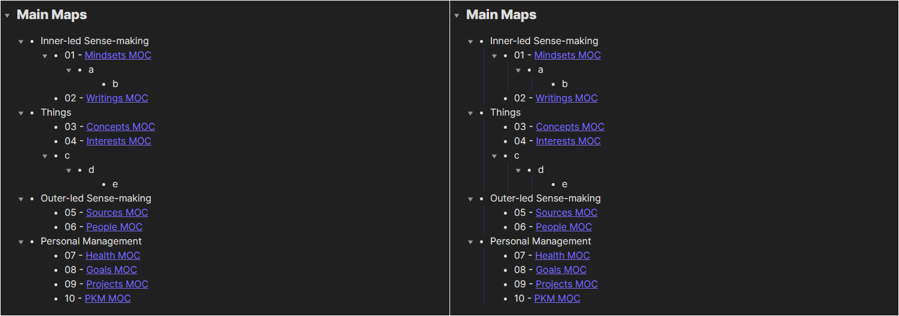
[📁 bullet-point-relationship-lines.css](code/css-snippets/bullet-point-relationship-lines.css)

---

## [Auto-fading UI](code/css-snippets/autofading-ui.css)

by [@Rumen Dimitrov](https://forum.obsidian.md/u/rsdimitrov)

Fades note's header controls and status bar items when not hovered.

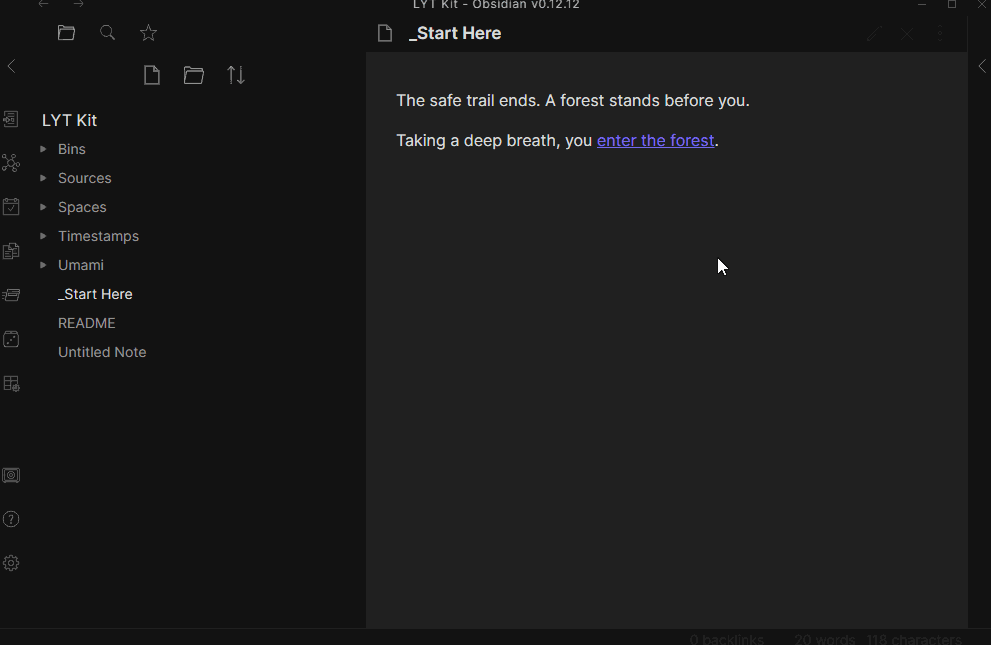
[📁 autofading-ui.css](code/css-snippets/autofading-ui.css)

---

## [Smaller Scrollbar](code/css-snippets/smaller-scrollbar.css)

by [@Rumen Dimitrov](https://forum.obsidian.md/u/rsdimitrov)

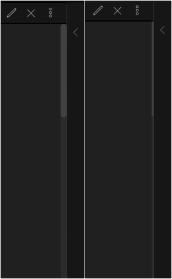

[📁 smaller-scrollbar.css](code/css-snippets/smaller-scrollbar.css)

---

## [Subtler Folding Gutter Arrows](code/css-snippets/subtler-folding-gutter-arrows.css)

by [@Rumen Dimitrov](https://forum.obsidian.md/u/rsdimitrov)

Increases the size of the folding gutter arrows and decreases their opacity until hovered.

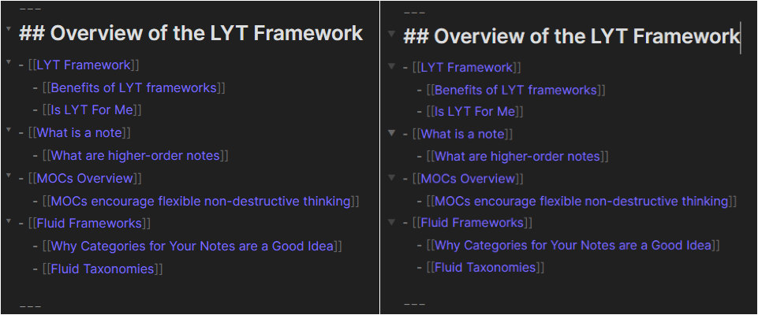

[📁 subtler-folding-gutter-arrows.css](code/css-snippets/subtler-folding-gutter-arrows.css)

---

## [Hyphenation and Justification](code/css-snippets/hyphenation-and-justification.css)

by [@Boyd](https://forum.obsidian.md/u/boyd/summary)

Justifies the whole text and breaks words into two lines if needed.

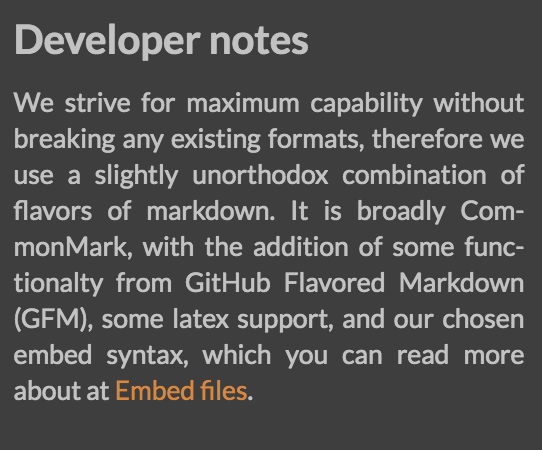

[📁 hyphenation-and-justification.css](code/css-snippets/hyphenation-and-justification.css)

---

## [Enlarge Image on Hover](code/css-snippets/enlarge-image-on-hover.css)

by [@den](https://forum.obsidian.md/u/den/summary)

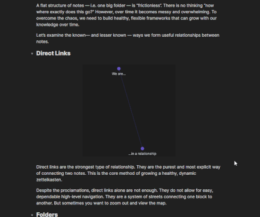

[📁 enlarge-image-on-hover.css](code/css-snippets/enlarge-image-on-hover.css)

---

## [Nicer Checkboxes](code/css-snippets/nicer-checkboxes.css)

by [@kepano](https://forum.obsidian.md/u/kepano/summary) & [@rsdimitrov](https://forum.obsidian.md/u/rsdimitrov)

To toggle a checkbox, place your cursor right after it, press left arrow once and then press backspace.

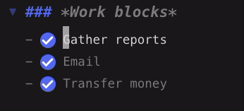

[📁 nicer-checkboxes.css](code/css-snippets/nicer-checkboxes.css)

---

## [Stylish Block Quotes](code/css-snippets/stylish-blockquotes.css)

by [@Thery](https://forum.obsidian.md/u/Thery/summary)

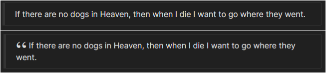

[📁 stylish-blockquotes.css](code/css-snippets/stylish-blockquotes.css)

---

## [Bigger Link Popup Preview](code/css-snippets/bigger-link-popup-preview.css)

by [@Cannibalox](https://github.com/cannibalox) & [@konhi](https://github.com/konhi)

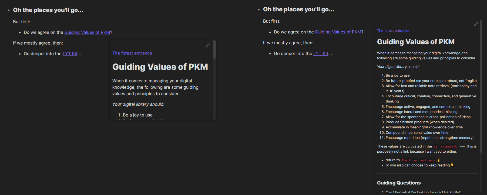

[📁 bigger-link-popup-preview.css](code/css-snippets/bigger-link-popup-preview.css)

---

## [Custom Icons Differing Files and Folders](code/css-snippets/custom-icons-differing-files-and-folders.css)

by [@deathau](https://github.com/deathau)

Adds custom icons for files and folders. Please read the comments in the `.css` file.

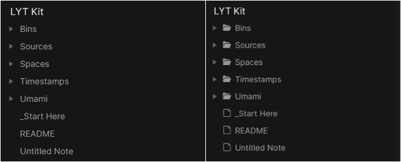

[📁 custom-icons-differing-files-and-folders.css](code/css-snippets/custom-icons-differing-files-and-folders.css)

[📁 IcoMoon.io Free Version](https://github.com/Keyamoon/IcoMoon-Free/archive/master.zip)

---

## [Custom Icons for Specific Folders](code/css-snippets/custom-icons-for-specific-folders.css)

by [@ScottKillen](https://github.com/ScottKillen)

Adds custom icons to **specific** folders.

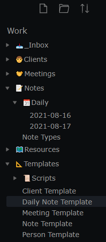

[📁 custom-icons-for-specific-folders.css](code/css-snippets/custom-icons-for-specific-folders.css)

---

## [Tag Pills](code/css-snippets/tag-pills.css)

by [@uzerper](https://forum.obsidian.md/u/uzerper)

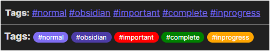

[📁 tag-pills.css](code/css-snippets/tag-pills.css)

---

## [Custom Icons for Frontmatter Tags](code/css-snippets/custom-icons-for-frontmatter-tags.css)

by [@ScottKillen](https://github.com/ScottKillen)

Adds custom icons to **specific** tags in the frontmatter section.
Compatible with [Tag Pills](#tag-pills) and most themes, including [minimal](https://forum.obsidian.md/t/minimal-theme/3659).

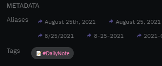

[📁 custom-icons-for-frontmatter-tags.css](code/css-snippets/custom-icons-for-frontmatter-tags.css)

---

## [Outliner For The Outline and File Explorer](code/css-snippets/outliner-for-the-outline-and-file-explorer.css)

by [@Shamama](https://forum.obsidian.md/u/Shamama), [@wonton](https://forum.obsidian.md/u/wonton/summary) & [@konhi](https://github.com/konhi)

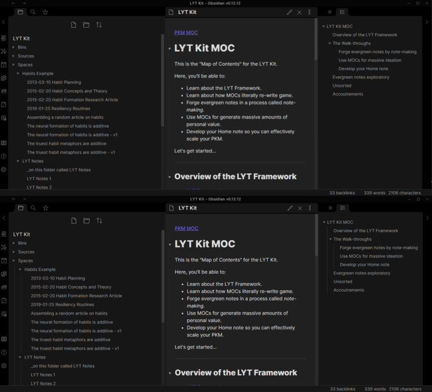

[📁 outliner-for-the-outline-and-file-explorer.css](code/css-snippets/outliner-for-the-outline-and-file-explorer.css)

---

## [Better Bullet Points in Edit Mode](code/css-snippets/better-bullet-points-in-edit-mode.css)

by [@Piotr](https://forum.obsidian.md/u/Piotr) & [@konhi](https://github.com/konhi)

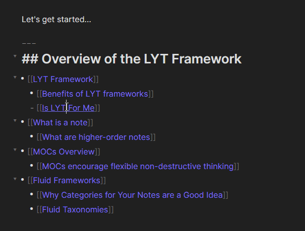

[📁 better-bullet-points-in-edit-mode.css](code/css-snippets/better-bullet-points-in-edit-mode.css)

---

## [Image Cards](code/css-snippets/image-cards.css)

by [@TClark1011](https://github.com/TClark1011)

Give your images a shadow and rounded corners.

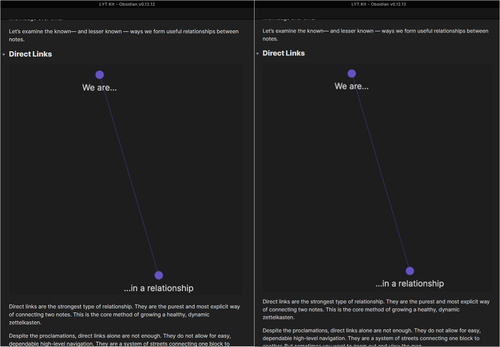

[📁 image-cards.css](code/css-snippets/image-cards.css)

---

# Themes

Most themes should be available through the `Appearance` => `Community themes` in Obsidian's settings. You can find more info at [Obsidian Help/Add custom styles](https://help.obsidian.md/How+to/Add+custom+styles).

| Repository | Screenshot |
| :-----------: | :-----------: |
| [kognise/obsidian-atom](https://github.com/kognise/obsidian-atom) |  |
| [cotemaxime/obsidian-amethyst](https://github.com/cotemaxime/obsidian-amethyst) |  |
| [insanum/obsidian_gruvbox](https://github.com/insanum/obsidian_gruvbox) |  |
| [insanum/obsidian_nord](https://github.com/insanum/obsidian_nord) |  |
| [jarodise/Dracula-for-Obsidian.md](https://github.com/jarodise/Dracula-for-Obsidian.md) |  |
| [chad-bennett/warmth-obsidian-theme](https://github.com/chad-bennett/warmth-obsidian-theme) |  |
| [dogwaddle/obsidian-gastown-theme.md](https://github.com/dogwaddle/obsidian-gastown-theme.md) |  |
| [deathau/80s-Neon-for-Obsidian.md](https://github.com/deathau/80s-Neon-for-Obsidian.md) |  |
| [deathau/Base2Tone-For-Obsidian.md](https://github.com/deathau/Base2Tone-For-Obsidian.md) |  |
| [deathau/Notation-for-Obsidian](https://github.com/deathau/Notation-for-Obsidian) |  |
| [deathau/obsidian-christmas-theme](https://github.com/deathau/obsidian-christmas-theme) |  |
| [Slowbad/obsidian-solarized](https://github.com/Slowbad/obsidian-solarized) |  |
| [obsidian-ezs/obsidian-comfort-color-dark](https://github.com/obsidian-ezs/obsidian-comfort-color-dark) |  |
| [obsidian-ezs/obsidian-ursa](https://github.com/obsidian-ezs/obsidian-ursa) |  |
| [nickmilo/Cybertron](https://github.com/nickmilo/Cybertron) |  |
| [kartik-karz/moonlight-obsidian](https://github.com/kartik-karz/moonlight-obsidian) |  |
| [seanwcom/Red-Graphite-for-Obsidian](https://github.com/seanwcom/Red-Graphite-for-Obsidian) |  |
| [kartik-karz/subtlegold-obsidian](https://github.com/kartik-karz/subtlegold-obsidian) |  |
| [sainadh-d/obsidian-boom](https://github.com/sainadh-d/obsidian-boom) |  |
| [pgalliford/Obsidian-theme-Incredible-Hulk](https://github.com/pgalliford/Obsidian-theme-Incredible-Hulk) |  |
| [GuangluWu/obsidian-pisum](https://github.com/GuangluWu/obsidian-pisum) |  |
| [elliotboyd/obsidian-traffic-lights](https://github.com/elliotboyd/obsidian-traffic-lights) |  |
| [mediapathic/obsidian-arsmagna-theme](https://github.com/mediapathic/obsidian-arsmagna-theme) |  |
| [cannibalox/Obsdn-dark-rmx](https://github.com/cannibalox/Obsdn-dark-rmx) |  |
| [kepano/obsidian-minimal](https://github.com/kepano/obsidian-minimal) |  |
| [rcvd/obsidian_ia](https://github.com/rcvd/obsidian_ia) |  |
| [bcdavasconcelos/Obsidian-Charcoal](https://github.com/bcdavasconcelos/Obsidian-Charcoal) |  |
| [bcdavasconcelos/Obsidian-Panic_Mode](https://github.com/bcdavasconcelos/Obsidian-Panic_Mode) |  |
| [bcdavasconcelos/Obsidian-Graphite](https://github.com/bcdavasconcelos/Obsidian-Graphite) |  |
| [bcdavasconcelos/Obsidian-Ayu](https://github.com/bcdavasconcelos/Obsidian-Ayu) |  |
| [bcdavasconcelos/Obsidian-Ayu_Mirage](https://github.com/bcdavasconcelos/Obsidian-Ayu_Mirage) |  |
| [bcdavasconcelos/Obsidian-GDCT](https://github.com/bcdavasconcelos/Obsidian-GDCT) |  |
| [bcdavasconcelos/Obsidian-GDCT_Dark](https://github.com/bcdavasconcelos/Obsidian-GDCT_Dark) |  |
| [DubininDmitry/Obuntu-theme-for-Obsidian](https://github.com/DubininDmitry/Obuntu-theme-for-Obsidian) |  |
| [cannibalox/ono-sendai_obsdn](https://github.com/cannibalox/ono-sendai_obsdn) |  |
| [whyt-byte/Blue-Topaz_Obsidian-css](https://github.com/whyt-byte/Blue-Topaz_Obsidian-css) |  |
| [santiyounger/Reverie-Obsidian-Theme](https://github.com/santiyounger/Reverie-Obsidian-Theme) |  |
| [ryjjin/Obsidian-Dark-Graphite-Pie-theme](https://github.com/ryjjin/Obsidian-Dark-Graphite-Pie-theme) |  |
| [bennyxguo/Obsidian-Obsidianite](https://github.com/bennyxguo/Obsidian-Obsidianite) |  |
| [ishgunacar/gitsidian](https://github.com/ishgunacar/gitsidian) |  |
| [jamiebrynes7/clair-de-lune-obsidian-theme](https://github.com/jamiebrynes7/clair-de-lune-obsidian-theme) |  |
| [manassadasivuni/obsidian-molecule](https://github.com/manassadasivuni/obsidian-molecule) |  |
| [sparklau/comfort-smooth](https://github.com/sparklau/comfort-smooth) |  |
| [dxcore35/Suddha-theme](https://github.com/dxcore35/Suddha-theme) |  |
| [mgmeyers/obsidian-california-coast-theme](https://github.com/mgmeyers/obsidian-california-coast-theme) |  |
| [radekkozak/discordian](https://github.com/radekkozak/discordian) |  |
| [chad-bennett/al-dente-obsidian-theme](https://github.com/chad-bennett/al-dente-obsidian-theme) |  |
| [santiyounger/Wasp-Obsidian-Theme](https://github.com/santiyounger/Wasp-Obsidian-Theme) |  |
| [davidgolding/obsidian-big-sur-aesthetic](https://github.com/davidgolding/obsidian-big-sur-aesthetic) |  |
| [lukauskas/obsidian-highlighter-theme](https://github.com/lukauskas/obsidian-highlighter-theme) |  |
| [SlRvb/Obsidian--ITS-Theme](https://github.com/SlRvb/Obsidian--ITS-Theme) |  |
| [Braweria/Spectrum](https://github.com/Braweria/Spectrum) |  |
| [hipstersmoothie/hipstersmoothie-obsidian-theme](https://github.com/hipstersmoothie/hipstersmoothie-obsidian-theme) |  |
| [hungsu/vileplume-obsidian](https://github.com/hungsu/vileplume-obsidian) |  |
| [auroral-ui/aurora-obsidian-md](https://github.com/auroral-ui/aurora-obsidian-md) |  |
| [izumin5210/obsidian-iceberg](https://github.com/izumin5210/obsidian-iceberg) |  |
| [bencodezen/obsidian-night-owl-theme](https://github.com/bencodezen/obsidian-night-owl-theme) |  |
| [chetachiezikeuzor/Yin-and-Yang-Theme](https://github.com/chetachiezikeuzor/Yin-and-Yang-Theme) |  |
| [shaggyfeng/obsidian-Golden-Topaz-theme](https://github.com/shaggyfeng/obsidian-Golden-Topaz-theme) |  |
| [shaggyfeng/obsidian-Pink-topaz-theme](https://github.com/shaggyfeng/obsidian-Pink-topaz-theme) |  |
| [eleanorkonik/-palatinate](https://github.com/eleanorkonik/-palatinate) |  |
| [sergey900553/obsidian_githublike_theme](https://github.com/sergey900553/obsidian_githublike_theme) |  |
| [Wittionary/mammoth-obsidian-theme](https://github.com/Wittionary/mammoth-obsidian-theme) |  |
| [luke-rmaki/rmaki-obsidian](https://github.com/luke-rmaki/rmaki-obsidian) |  |
| [ArtexJay/Obsidian-CyberGlow](https://github.com/ArtexJay/Obsidian-CyberGlow) |  |
| [johackim/obsidian-darkyan](https://github.com/johackim/obsidian-darkyan) |  |
| [mrglitchbyte/obsidian_everforest](https://github.com/mrglitchbyte/obsidian_everforest) |  |
| [ZaherAlMajed/Illusion-Theme.md](https://github.com/ZaherAlMajed/Illusion-Theme.md) |  |
| [tylernguyen/obsidian-horizon](https://github.com/tylernguyen/obsidian-horizon) |  |
| [RuslanGagushin/Tokyo-Night-Obsidian-Theme](https://github.com/RuslanGagushin/Tokyo-Night-Obsidian-Theme) |  |
| [nikbrunner/obsidian-deep-work-theme](https://github.com/nikbrunner/obsidian-deep-work-theme) |  |
| [vanadium23/obsidian-blackbird-theme](https://github.com/vanadium23/obsidian-blackbird-theme) |  |
| [kinmury/GoldenCoffeeTheme](https://github.com/kinmury/GoldenCoffeeTheme) |  |
| [Chrismettal/Obsidian-Behave-dark](https://github.com/Chrismettal/Obsidian-Behave-dark) |  |
| [SMUsamaShah/Obsidian-Win98-Edition](https://github.com/SMUsamaShah/Obsidian-Win98-Edition) |  |
| [dogwaddle/lizardmen-zettelkasten](https://github.com/dogwaddle/lizardmen-zettelkasten) |  |
| [firinael/obsidian-cidreira-coast-theme](https://github.com/firinael/obsidian-cidreira-coast-theme) |  |
| [chrisgrieser/shimmering-focus](https://github.com/chrisgrieser/shimmering-focus) |  |

# For Developers

## Creating Themes

- [#custom-css at Obsidian Forum](https://forum.obsidian.md/tag/custom-css)
  - [Getting comfortable with Obsidian CSS](https://forum.obsidian.md/t/getting-comfortable-with-obsidian-css/133)
  - [Common Selectors for Custom CSS](https://forum.obsidian.md/t/common-selectors-for-custom-css/1984)
  - [CSS Themes Showcase](https://forum.obsidian.md/t/meta-post-css-themes-showcase/76)
- [🎬 Create a Custom Theme in Obsidian](https://www.youtube.com/watch?v=lyaEnxgow4E)
- [ReggieNotes' about Obsidian CSS Themes](https://publish.obsidian.md/reggienotes/Quickstart+CSS+Guide/010+Obsidian+CSS+Themes)
- [obsidian-style-settings:](https://github.com/mgmeyers/obsidian-style-settings)  allows snippet, theme, and plugin CSS files to define a set of configuration options. It then allows users to see all the tweakable settings in one settings pane.

## Creating Plugins

- [Developers & API at Obsidian Forum](https://forum.obsidian.md/c/developers-api/14)
  - [How to get started with developing a custom plugin](https://forum.obsidian.md/t/how-to-get-started-with-developing-a-custom-plugin/8157)
  - [Using GitHub actions to release plugins](https://forum.obsidian.md/t/using-github-actions-to-release-plugins/7877)
  - [Hot Reload](https://forum.obsidian.md/t/plugin-release-for-developers-hot-reload-the-plugin-s-youre-developing/12185)
  - [Plugins mini FAQ](https://forum.obsidian.md/t/plugins-mini-faq/7737)
  - [List of available icons](https://forum.obsidian.md/t/list-of-available-icons-for-component-seticon/16332/4)
  - [Alpha Plugin List](https://forum.obsidian.md/t/meta-alpha-plugin-list-0-9-7/7736)
- [Obsidian at GitHub](https://github.com/obsidianmd)
  - [Obsidian API](https://github.com/obsidianmd/obsidian-api)
  - [Obsidian Sample Plugin](https://github.com/obsidianmd/obsidian-sample-plugin)
- [obsidian-tools:](https://github.com/obsidian-tools/obsidian-tools) an unofficial collection of tools that helps devs build plugins for obsidian.
- [obsidian-rust-plugin:](https://github.com/trashhalo/obsidian-rust-plugin) boilerplate needed to write obsidian plugins in rust!
- [obsidian-api-docs:](https://github.com/HEmile/obsidian-api-docs/blob/main/docs/00_Home.md) community-provided documentation of the Obsidian API.
- [obsidian-dev-tools:](https://github.com/KjellConnelly/obsidian-dev-tools)  allows for a modified console (useful for debugging on mobile), and viewing all Obsidian icons/strings.
- [obsidian-daily-notes-interface:](https://github.com/liamcain/obsidian-daily-notes-interface) a collection of utility functions for working with dates and daily notes in Obsidian plugins.
- [obsidian-calendar-ui:](https://github.com/liamcain/obsidian-calendar-ui) provides an out-of-the-box calendar view for Obsidian plugins.
- [obsidian-plugin-template](https://github.com/THeK3nger/obsidian-plugin-template): a plugin template customized with a nicer directory structure and some additional tool (like featuring automatic releases with Github's Actions).
- [obsidian-vault-parser](https://github.com/coffee-cup/obsidian-vault-parser): vault parser for the Obsidian note taking app.
- [Liam Cain's Obsidian API FAQ](https://liamca.in/Obsidian/API+FAQ/index)
- [#obsidian-md at GitHub](https://github.com/topics/obsidian-md)
- [Svelte (sometimes used by plugin developers to create components)](https://svelte.dev/)
- [What tools and libraries are used in Obsidian?](https://konhi.me/obsidian-stack.html)

